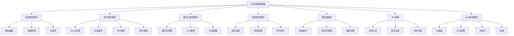
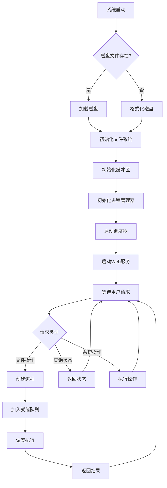
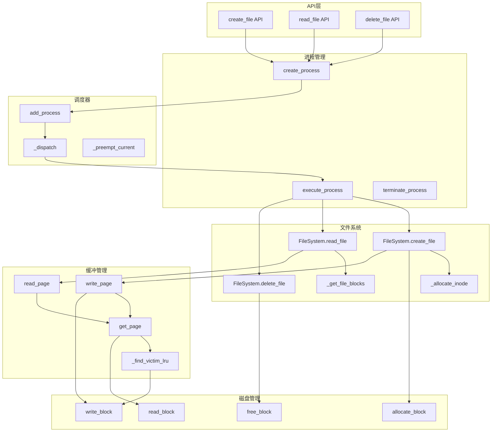

# 操作系统课程设计报告

# 文件系统模拟器设计与实现

---

## 1 前言

### 1.1 选择的题目要求

本次课程设计选择实现操作系统文件系统模拟器，具体技术选型如下：

| 项目 | 选择方案 |
|------|----------|
| 文件访问方式 | 非阻塞I/O |
| 通信模式 | 共享内存 |
| 同步机制 | 条件变量 |
| 调度策略 | 时间片轮转(RR) |
| 磁盘组织方式 | 位图+索引 |

### 1.2 设计目的

1. **深入理解操作系统原理**：通过实际编程实现文件系统、进程管理、内存管理等核心功能，加深对操作系统运行机制的理解。

2. **掌握系统编程技术**：学习使用多线程、同步原语（条件变量、锁）、共享内存等系统编程技术。

3. **提升软件工程能力**：采用模块化设计，实现前后端分离架构，提高代码质量和可维护性。

4. **培养实践能力**：将理论知识应用于实际项目开发，培养解决实际问题的能力。

### 1.3 设计意义

本项目模拟了一个完整的文件系统，涵盖了操作系统的多个核心概念：

- **存储管理**：磁盘空间分配、位图管理、索引结构
- **文件系统**：文件创建/删除/读写、目录管理、iNode结构
- **内存管理**：缓冲区管理、页面置换算法（LRU）
- **进程管理**：进程状态管理、进程间通信（共享内存）
- **进程调度**：时间片轮转调度算法
- **同步互斥**：条件变量、读写锁

---

## 2 需求分析

### 2.1 程序设计任务

设计并实现一个基于模拟磁盘的文件系统，具备以下功能：

1. **磁盘模拟**
   - 创建M×N大小的虚拟磁盘（M=64B, N=1024块）
   - 实现位图法管理空闲块
   - 支持块的分配与释放

2. **文件系统**
   - 支持文件的创建、读取、修改、删除
   - 支持目录的创建和遍历
   - 采用混合索引方式组织文件数据
   - 实现iNode结构存储文件元信息

3. **内存缓冲**
   - 实现M×K大小的缓冲区（K=16页）
   - 采用LRU算法进行页面置换
   - 记录缓冲页的访问信息和修改状态

4. **进程管理**
   - 每个命令作为独立进程执行
   - 实现进程间共享内存通信
   - 使用条件变量实现同步互斥

5. **进程调度**
   - 实现时间片轮转（RR）调度算法
   - 支持进程的创建、调度、终止

6. **可视化**
   - 提供Web界面展示系统状态
   - 实时显示磁盘、缓冲区、进程状态
   - 支持动态刷新和交互操作

### 2.2 功能模块图

```
【图2-1：系统功能模块图】

描述：使用树形结构展示系统的功能模块划分

Mermaid代码：


### 2.3 系统流程图

```
【图2-2：系统主流程图】

描述：展示系统启动到运行的主要流程

Mermaid代码：


### 2.4 输入输出规范

#### 2.4.1 正确输入及输出

| 操作 | 输入示例 | 输出示例 |
|------|----------|----------|
| 创建文件 | `touch test.txt Hello World` | `文件 'test.txt' 已创建` |
| 读取文件 | `cat test.txt` | `Hello World` |
| 列目录 | `ls` | `-rw-  1块  11B  test.txt` |
| 删除文件 | `rm test.txt` | `文件 'test.txt' 已删除` |
| 查看磁盘 | `disk` | 磁盘使用情况统计 |
| 查看缓冲 | `buffer` | 缓冲区状态统计 |

#### 2.4.2 错误输入及输出

| 操作 | 错误输入 | 输出 |
|------|----------|------|
| 创建已存在文件 | `touch test.txt` (已存在) | `文件 test.txt 已存在` |
| 读取不存在文件 | `cat notexist.txt` | `文件 notexist.txt 不存在` |
| 删除被占用文件 | `rm busy.txt` (正在使用) | `文件 busy.txt 正在被使用，无法删除` |
| 磁盘空间不足 | 创建大文件 | `磁盘空间不足` |

### 2.5 组内分工说明

| 成员 | 负责模块 | 主要工作 |
|------|----------|----------|
| 成员A | 磁盘管理、文件系统 | 虚拟磁盘实现、位图管理、iNode结构、文件操作 |
| 成员B | 缓冲区管理 | 缓冲页结构、LRU算法、写回策略 |
| 成员C | 进程管理、调度器 | 进程控制块、RR调度、共享内存 |
| 成员D | Web界面、集成测试 | 前端开发、API设计、系统测试 |

---

## 3 系统设计

### 3.1 数据结构定义

#### 3.1.1 磁盘相关数据结构

```python
# 磁盘配置常量
BLOCK_SIZE = 64          # 每个盘块大小（字节）
BLOCK_COUNT = 1024       # 盘块数量
DISK_SIZE = 65536        # 总磁盘大小（64KB）

# 磁盘布局常量
SUPERBLOCK_BLOCKS = 1    # 超级块占用块数
BITMAP_BLOCKS = 2        # 位图区块数
INODE_BLOCKS = 32        # iNode区块数
DATA_START_BLOCK = 35    # 数据区起始块号

# 超级块结构（存储在块0）
SuperBlock = {
    'magic': 0x4F534653,     # 魔数 'OSFS'
    'version': 1,            # 版本号
    'block_size': 64,        # 块大小
    'total_blocks': 1024,    # 总块数
    'free_blocks': 989,      # 空闲块数
    'data_start': 35,        # 数据区起始
    'inode_count': 32,       # iNode数量
    'create_time': timestamp # 创建时间
}
```

#### 3.1.2 iNode数据结构

```python
@dataclass
class INode:
    """iNode结构（64字节）"""
    inode_id: int           # 2字节，iNode编号
    file_type: FileType     # 1字节，文件类型
    permissions: int        # 1字节，权限位
    size: int               # 4字节，文件大小
    create_time: int        # 8字节，创建时间戳
    modify_time: int        # 8字节，修改时间戳
    link_count: int         # 2字节，链接计数
    direct_blocks: List[int]  # 12字节，6个直接索引
    single_indirect: int    # 2字节，一级间接索引
    double_indirect: int    # 2字节，二级间接索引
    # 保留22字节
```

```
【图3-1：iNode结构布局图】

描述：展示64字节iNode的内存布局

+-------+------+------+------+----------+----------+------+
| 0-1   | 2    | 3    | 4-7  | 8-15     | 16-23    | 24-25|
|iNode  |Type  |Perm  |Size  |CreateTime|ModifyTime|Links |
+-------+------+------+------+----------+----------+------+
| 26-27 | 28-29| 30-31| 32-33| 34-35    | 36-37    |38-39 |
|Block0 |Block1|Block2|Block3|Block4    |Block5    |Indir1|
+-------+------+------+------+----------+----------+------+
| 40-41 | 42-63                                           |
|Indir2 | Reserved (22 bytes)                             |
+-------+-------------------------------------------------+
```

#### 3.1.3 目录项数据结构

```python
@dataclass
class DirectoryEntry:
    """目录项结构（26字节）"""
    name: str       # 24字节，文件名（UTF-8）
    inode_id: int   # 2字节，iNode号
```

#### 3.1.4 缓冲页数据结构

```python
class PageState(Enum):
    FREE = 0       # 空闲
    CLEAN = 1      # 干净（与磁盘一致）
    DIRTY = 2      # 脏页（已修改）

@dataclass
class BufferPage:
    """缓冲页结构"""
    page_id: int           # 缓冲页ID
    block_id: int          # 对应的磁盘块号
    owner_process: int     # 所有者进程ID
    data: bytearray        # 页面数据（64字节）
    state: PageState       # 页面状态
    access_time: float     # 最后访问时间
    access_count: int      # 访问计数
    is_pinned: bool        # 是否被钉住
```

#### 3.1.5 进程控制块

```python
class ProcessState(Enum):
    NEW = 0         # 新建
    READY = 1       # 就绪
    RUNNING = 2     # 运行
    BLOCKED = 3     # 阻塞
    TERMINATED = 4  # 终止

@dataclass
class Process:
    """进程控制块（PCB）"""
    pid: int                # 进程ID
    name: str               # 进程名称
    state: ProcessState     # 进程状态
    command: CommandType    # 命令类型
    args: Dict              # 命令参数
    result: Any             # 执行结果
    create_time: float      # 创建时间
    cpu_time: float         # CPU使用时间
    time_slice: int         # 分配的时间片
    remaining_time: int     # 剩余时间片
```

### 3.2 主要函数定义

#### 3.2.1 磁盘管理函数

```python
class VirtualDisk:
    def __init__(self, disk_path: str)
        """初始化虚拟磁盘"""
    
    def allocate_block(self) -> Optional[int]
        """分配一个空闲块，返回块号"""
    
    def free_block(self, block_id: int)
        """释放指定块"""
    
    def read_block(self, block_id: int) -> bytes
        """读取指定块内容"""
    
    def write_block(self, block_id: int, data: bytes)
        """写入数据到指定块"""
    
    def get_bitmap_status(self) -> List[bool]
        """获取位图状态"""
```

#### 3.2.2 文件系统函数

```python
class FileSystem:
    def create_file(self, filename: str, content: bytes, 
                    permissions: int) -> Dict
        """创建新文件"""
    
    def read_file(self, filename: str, 
                  block_index: int = -1) -> Dict
        """读取文件内容"""
    
    def write_file(self, filename: str, content: bytes, 
                   block_index: int = -1) -> Dict
        """修改文件内容"""
    
    def delete_file(self, filename: str) -> Dict
        """删除文件"""
    
    def list_directory(self) -> Dict
        """列出当前目录内容"""
    
    def open_file(self, filename: str, process_id: int, 
                  mode: str) -> Dict
        """打开文件（非阻塞I/O）"""
    
    def close_file(self, filename: str, 
                   process_id: int) -> Dict
        """关闭文件"""
```

#### 3.2.3 缓冲区管理函数

```python
class BufferManager:
    def get_page(self, block_id: int, 
                 process_id: int) -> Optional[int]
        """获取包含指定块的缓冲页"""
    
    def read_page(self, block_id: int, 
                  process_id: int) -> Optional[bytes]
        """读取指定块内容"""
    
    def write_page(self, block_id: int, data: bytes, 
                   process_id: int) -> bool
        """写入数据到指定块"""
    
    def _find_victim_lru(self) -> Optional[int]
        """LRU算法选择牺牲页"""
    
    def flush_all(self)
        """刷新所有脏页到磁盘"""
```

#### 3.2.4 调度器函数

```python
class RRScheduler:
    def start(self)
        """启动调度器"""
    
    def stop(self)
        """停止调度器"""
    
    def add_process(self, pid: int)
        """将进程添加到就绪队列"""
    
    def _select_next_process(self) -> Optional[int]
        """选择下一个要运行的进程"""
    
    def _dispatch(self, pid: int)
        """调度进程运行"""
    
    def _preempt_current(self)
        """抢占当前进程"""
```

### 3.3 系统调用分析

本项目使用的主要系统调用和库函数：

| 函数/方法 | 用途 | 模块 |
|-----------|------|------|
| `threading.RLock()` | 可重入锁 | 同步控制 |
| `threading.Condition()` | 条件变量 | 进程同步 |
| `threading.Thread()` | 创建线程 | 进程模拟 |
| `open()/read()/write()` | 文件I/O | 磁盘访问 |
| `struct.pack/unpack` | 二进制数据处理 | 数据序列化 |
| `time.time()` | 获取时间戳 | 时间记录 |

### 3.4 函数调用关系图

```
【图3-2：函数调用关系图】

描述：展示主要模块间的调用关系

Mermaid代码：


### 3.5 主程序伪码

```
算法: 文件系统模拟器主程序

输入: 无
输出: 运行Web服务

BEGIN
    // 1. 初始化系统组件
    disk = new VirtualDisk("virtual_disk.bin")
    filesystem = new FileSystem(disk)
    buffer_manager = new BufferManager(disk)
    process_manager = new ProcessManager()
    scheduler = new RRScheduler(process_manager)
    shm_manager = new SharedMemoryManager()
    
    // 2. 注册命令处理器
    FOR each command_type IN [CREATE, READ, WRITE, DELETE, ...]
        process_manager.register_handler(command_type, handler_function)
    END FOR
    
    // 3. 启动后台服务
    start_status_broadcaster()  // 状态广播线程
    scheduler.start()           // 启动调度器
    
    // 4. 启动Web服务
    flask_app.run(host='0.0.0.0', port=5000)
    
    // 5. 主循环（由Flask处理）
    WHILE True DO
        request = wait_for_request()
        
        IF request.type == FILE_OPERATION THEN
            // 创建进程执行文件操作
            pid = process_manager.create_process(request.command, request.args)
            scheduler.add_process(pid)
            result = process_manager.execute_process(pid)
            send_response(result)
            
        ELSE IF request.type == QUERY THEN
            // 直接查询状态
            status = get_system_status()
            send_response(status)
            
        ELSE IF request.type == SYSTEM_OPERATION THEN
            // 执行系统操作
            result = execute_system_operation(request.operation)
            send_response(result)
        END IF
    END WHILE
END
```

```
算法: LRU页面置换

输入: 需要加载的块号block_id, 请求进程process_id
输出: 分配的缓冲页号

BEGIN
    // 1. 检查块是否已在缓冲区
    IF block_id IN block_to_page_mapping THEN
        page_id = block_to_page_mapping[block_id]
        pages[page_id].access_time = current_time()
        pages[page_id].access_count++
        RETURN page_id
    END IF
    
    // 2. 查找空闲页
    FOR i = 0 TO BUFFER_PAGE_COUNT - 1 DO
        IF pages[i].state == FREE THEN
            load_page(i, block_id, process_id)
            RETURN i
        END IF
    END FOR
    
    // 3. LRU选择牺牲页
    victim = NULL
    oldest_time = INFINITY
    
    FOR i = 0 TO BUFFER_PAGE_COUNT - 1 DO
        IF pages[i].is_pinned THEN
            CONTINUE
        END IF
        
        IF pages[i].access_time < oldest_time THEN
            oldest_time = pages[i].access_time
            victim = i
        END IF
    END FOR
    
    IF victim == NULL THEN
        RETURN NULL  // 所有页都被钉住
    END IF
    
    // 4. 置换页面
    IF pages[victim].state == DIRTY THEN
        write_back_to_disk(victim)
    END IF
    
    load_page(victim, block_id, process_id)
    RETURN victim
END
```

```
算法: 时间片轮转调度

输入: 无（从就绪队列获取进程）
输出: 无（循环执行调度）

BEGIN
    WHILE scheduler_state == RUNNING DO
        // 1. 从就绪队列获取进程
        IF ready_queue.is_empty() THEN
            idle_wait(100ms)
            CONTINUE
        END IF
        
        pid = ready_queue.dequeue()
        process = get_process(pid)
        
        // 2. 检查进程有效性
        IF process == NULL OR process.state != READY THEN
            CONTINUE
        END IF
        
        // 3. 调度进程运行
        process.state = RUNNING
        current_process = pid
        current_start_time = current_time()
        
        // 4. 运行一个时间片
        WHILE elapsed_time() < TIME_QUANTUM DO
            IF process.state == TERMINATED THEN
                BREAK
            END IF
            IF process.state == BLOCKED THEN
                BREAK
            END IF
            sleep(10ms)  // 检查间隔
        END WHILE
        
        // 5. 处理时间片用完
        IF process.state == RUNNING THEN
            // 抢占：放回队列尾部
            process.state = READY
            process.cpu_time += elapsed_time()
            ready_queue.enqueue(pid)
            context_switch_count++
        END IF
        
        current_process = NULL
    END WHILE
END
```

---

## 4 系统实现

### 4.1 主要功能实现

#### 4.1.1 虚拟磁盘实现

虚拟磁盘使用二进制文件模拟，大小为64KB（1024块×64字节）。磁盘布局如下：

```
【图4-1：磁盘布局示意图】

+------------------+------------------+------------------+------------------+
|    块0 (超级块)   |   块1-2 (位图)   |  块3-34 (iNode)  | 块35-1023 (数据) |
+------------------+------------------+------------------+------------------+
|     64字节       |    128字节       |    2048字节      |    63424字节     |
+------------------+------------------+------------------+------------------+
```

位图管理采用字节数组，每个bit对应一个磁盘块：

```python
def allocate_block(self) -> Optional[int]:
    """分配空闲块 - 线性扫描位图"""
    for i in range(DATA_START_BLOCK, BLOCK_COUNT):
        byte_idx = i // 8
        bit_idx = i % 8
        if not (self.bitmap[byte_idx] & (1 << bit_idx)):
            # 标记为已使用
            self.bitmap[byte_idx] |= (1 << bit_idx)
            self.free_blocks -= 1
            self._save_bitmap()
            return i
    return None  # 磁盘已满
```

#### 4.1.2 混合索引实现

文件块采用混合索引方式，支持直接索引、一级间接索引和二级间接索引：

```python
def _get_file_blocks(self, inode: INode) -> List[int]:
    """获取文件的所有数据块号"""
    blocks = []
    
    # 1. 直接索引（6块）
    for block_id in inode.direct_blocks:
        if block_id > 0:
            blocks.append(block_id)
    
    # 2. 一级间接索引
    if inode.single_indirect > 0:
        indirect_data = self.disk.read_block(inode.single_indirect)
        for i in range(POINTERS_PER_BLOCK):
            block_id = struct.unpack_from('<H', indirect_data, i*2)[0]
            if block_id > 0:
                blocks.append(block_id)
    
    # 3. 二级间接索引
    if inode.double_indirect > 0:
        double_data = self.disk.read_block(inode.double_indirect)
        for i in range(POINTERS_PER_BLOCK):
            single_ptr = struct.unpack_from('<H', double_data, i*2)[0]
            if single_ptr > 0:
                single_data = self.disk.read_block(single_ptr)
                for j in range(POINTERS_PER_BLOCK):
                    block_id = struct.unpack_from('<H', single_data, j*2)[0]
                    if block_id > 0:
                        blocks.append(block_id)
    
    return blocks
```

```
【图4-2：混合索引结构图】

描述：展示iNode中的索引指针如何指向数据块

                    +----------+
                    |  iNode   |
                    +----------+
                    | 直接索引0 |---> [数据块]
                    | 直接索引1 |---> [数据块]
                    | ...      |
                    | 直接索引5 |---> [数据块]
                    +----------+
                    | 一级间接  |---> [索引块] ---> [数据块]
                    +----------+               ---> [数据块]
                    | 二级间接  |---> [索引块] ---> [索引块] ---> [数据块]
                    +----------+
```

#### 4.1.3 LRU页面置换实现

缓冲区管理采用LRU（最近最少使用）算法进行页面置换：

```python
def _find_victim_lru(self) -> Optional[int]:
    """LRU算法选择牺牲页"""
    victim = None
    oldest_time = float('inf')
    
    for i, page in enumerate(self.pages):
        # 跳过被钉住的页面
        if page.is_pinned:
            continue
        # 跳过空闲页面
        if page.state == PageState.FREE:
            continue
        # 选择访问时间最早的页面
        if page.access_time < oldest_time:
            oldest_time = page.access_time
            victim = i
    
    return victim

def _evict_page(self, page_id: int):
    """置换页面"""
    page = self.pages[page_id]
    
    # 脏页需要写回
    if page.state == PageState.DIRTY:
        self.disk.write_block(page.block_id, bytes(page.data))
        self.stats['writebacks'] += 1
    
    # 重置页面
    page.reset()
    self.stats['evictions'] += 1
```

#### 4.1.4 条件变量同步实现

使用Python的`threading.Condition`实现进程间同步：

```python
class SharedMemorySegment:
    def __init__(self, key: int, size: int):
        self.condition = threading.Condition(self.lock)
        self.readers = 0
        self.writers = 0
    
    def read(self, offset: int, length: int, process_id: int):
        """读操作 - 允许多读者"""
        with self.condition:
            # 等待写者完成
            while self.writers > 0:
                self.condition.wait()
            self.readers += 1
        
        try:
            return bytes(self.data[offset:offset+length])
        finally:
            with self.condition:
                self.readers -= 1
                if self.readers == 0:
                    self.condition.notify_all()
    
    def write(self, offset: int, data: bytes, process_id: int):
        """写操作 - 独占访问"""
        with self.condition:
            # 等待所有读者和写者完成
            while self.readers > 0 or self.writers > 0:
                self.condition.wait()
            self.writers += 1
        
        try:
            self.data[offset:offset+len(data)] = data
        finally:
            with self.condition:
                self.writers -= 1
                self.condition.notify_all()
```

#### 4.1.5 时间片轮转调度实现

```python
class RRScheduler:
    def _scheduler_loop(self):
        """调度器主循环"""
        while self.state == SchedulerState.RUNNING:
            # 获取就绪进程
            pid = self._select_next_process()
            
            if pid is None:
                time.sleep(0.1)  # 空闲等待
                continue
            
            # 调度运行
            self._dispatch(pid)
            
            # 运行时间片
            slice_start = time.time()
            while time.time() - slice_start < self.time_quantum / 1000.0:
                process = self.process_manager.get_process(pid)
                if process.state == ProcessState.TERMINATED:
                    break
                if process.state == ProcessState.BLOCKED:
                    break
                time.sleep(0.01)
            
            # 时间片用完，抢占
            if process.state == ProcessState.RUNNING:
                self._preempt_current()
    
    def _preempt_current(self):
        """抢占当前进程"""
        process = self.processes[self.current_pid]
        process.state = ProcessState.READY
        self.ready_queue.append(self.current_pid)  # 放回队列尾部
        self.stats['preemptions'] += 1
```

### 4.2 调试过程中遇到的问题及解决

#### 问题1：死锁问题

**现象**：多个进程同时访问文件系统时，程序卡死。

**原因**：使用普通Lock时，同一线程内部再次获取锁会导致死锁。

**解决方案**：将`threading.Lock()`改为`threading.RLock()`（可重入锁），允许同一线程多次获取锁。

```python
# 修改前
self.lock = threading.Lock()

# 修改后
self.lock = threading.RLock()
```

#### 问题2：缓冲区写回时机

**现象**：文件修改后，磁盘内容未更新。

**原因**：脏页仅在置换时写回，若程序正常退出，脏页丢失。

**解决方案**：
1. 添加`flush_all()`方法强制写回所有脏页
2. 在程序退出前调用刷新
3. 提供API供用户手动刷新

#### 问题3：二进制数据与字符串转换

**现象**：读取文件内容时出现乱码。

**原因**：文件内容以二进制存储，前端需要字符串。

**解决方案**：在API层进行编码转换，使用UTF-8解码，错误时使用replace模式：

```python
result['content'] = result['content'].decode('utf-8', errors='replace')
```

#### 问题4：WebSocket连接不稳定

**现象**：前端偶尔收不到状态更新。

**原因**：Flask-SocketIO默认使用eventlet，与threading冲突。

**解决方案**：指定async_mode为threading：

```python
socketio = SocketIO(app, cors_allowed_origins="*", async_mode='threading')
```

### 4.3 设计与实现的回顾

#### 4.3.1 设计优点

1. **模块化设计**：各模块独立，易于维护和扩展
2. **前后端分离**：Web界面与后端逻辑分离，便于调试
3. **可视化完善**：提供多维度的状态展示
4. **接口统一**：RESTful API设计，便于集成

#### 4.3.2 设计不足

1. **iNode数量固定**：当前设计最多32个iNode
2. **单级目录限制**：未完整实现多级目录
3. **文件大小限制**：受索引结构限制，最大约66KB

### 4.4 系统存在的问题及改进方法

| 问题 | 当前状态 | 改进方案 |
|------|----------|----------|
| iNode数量少 | 固定32个 | 动态分配iNode区 |
| 单级目录 | 基本支持 | 完善多级目录和路径解析 |
| 文件大小限制 | 约66KB | 增加三级间接索引 |
| 并发性能 | 中等 | 使用读写锁优化 |
| 崩溃恢复 | 无 | 添加日志和检查点机制 |

---

## 5 用户手册

### 5.1 环境要求

- Python 3.8 或更高版本
- 现代Web浏览器（Chrome、Firefox、Edge等）
- 约100MB磁盘空间

### 5.2 安装步骤

1. **安装Python依赖**
```bash
cd os_filesystem
pip install -r requirements.txt
```

2. **启动程序**
```bash
python app.py
```

3. **访问界面**
打开浏览器，访问 http://localhost:5000

### 5.3 界面操作说明

#### 5.3.1 仪表盘

显示系统整体状态：
- 磁盘使用情况
- iNode使用情况
- 缓冲区命中率
- 进程状态统计

快速操作按钮：
- 新建文件
- 新建目录
- 刷新缓冲
- 启动/停止调度

#### 5.3.2 文件管理

- **新建文件**：点击"新建文件"按钮，输入文件名和内容
- **查看文件**：点击文件图标，在右侧预览面板查看
- **编辑文件**：在预览面板修改内容，点击"保存修改"
- **删除文件**：在预览面板点击"删除文件"

#### 5.3.3 磁盘可视化

- 显示所有1024个磁盘块的使用状态
- 不同颜色表示不同区域：
  - 红色：超级块
  - 橙色：位图区
  - 紫色：iNode区
  - 青色：已使用数据块
  - 灰色：空闲块
- 点击任意块查看其内容

#### 5.3.4 内存缓冲

- 显示16个缓冲页状态
- 统计信息：命中/未命中/置换/写回次数
- 置换日志：记录页面进出

#### 5.3.5 进程管理

- 显示所有进程及其状态
- 创建测试进程
- 终止进程

#### 5.3.6 调度器

- 控制调度器启动/暂停/停止
- 设置时间片大小
- 显示就绪队列
- 调度事件日志

#### 5.3.7 终端

命令行界面，支持以下命令：

| 命令 | 功能 | 示例 |
|------|------|------|
| `ls` | 列出目录 | `ls` |
| `cat` | 查看文件 | `cat test.txt` |
| `touch` | 创建文件 | `touch hello.txt Hello World` |
| `rm` | 删除文件 | `rm test.txt` |
| `mkdir` | 创建目录 | `mkdir docs` |
| `cd` | 切换目录 | `cd docs` |
| `info` | 文件信息 | `info test.txt` |
| `disk` | 磁盘状态 | `disk` |
| `buffer` | 缓冲状态 | `buffer` |
| `ps` | 进程列表 | `ps` |
| `clear` | 清空终端 | `clear` |
| `help` | 帮助信息 | `help` |

### 5.4 API接口说明

系统提供RESTful API供外部调用：

| 接口 | 方法 | 功能 |
|------|------|------|
| `/api/files` | GET | 获取文件列表 |
| `/api/files` | POST | 创建文件 |
| `/api/files/<name>` | GET | 读取文件 |
| `/api/files/<name>` | PUT | 修改文件 |
| `/api/files/<name>` | DELETE | 删除文件 |
| `/api/disk/info` | GET | 磁盘信息 |
| `/api/disk/bitmap` | GET | 位图状态 |
| `/api/buffer/status` | GET | 缓冲状态 |
| `/api/processes` | GET | 进程列表 |
| `/api/scheduler/status` | GET | 调度状态 |

---

## 6 测试

### 6.1 测试环境

- 操作系统：Windows 10
- Python版本：3.10.0
- 浏览器：Chrome 120

### 6.2 功能测试

#### 测试1：文件创建与读取

**步骤**：
1. 在终端输入 `touch test.txt Hello World`
2. 输入 `cat test.txt`

**预期结果**：创建文件成功，读取内容为 "Hello World"

**实际结果**：✅ 通过

```
【图6-1：文件创建测试截图】
描述：终端界面显示创建文件和读取文件的命令执行结果
```

#### 测试2：文件删除保护

**步骤**：
1. 创建文件 `touch busy.txt Test`
2. 打开文件（保持打开状态）
3. 尝试删除 `rm busy.txt`

**预期结果**：提示文件正在使用，无法删除

**实际结果**：✅ 通过

#### 测试3：缓冲区LRU置换

**步骤**：
1. 创建多个文件填满缓冲区
2. 继续创建新文件
3. 观察缓冲区置换日志

**预期结果**：最久未使用的页面被置换

**实际结果**：✅ 通过

```
【图6-2：缓冲区置换测试截图】
描述：缓冲区面板显示16个页面状态和置换日志
```

#### 测试4：进程调度

**步骤**：
1. 启动调度器
2. 创建多个进程
3. 观察调度事件

**预期结果**：进程按RR算法轮转执行

**实际结果**：✅ 通过

#### 测试5：磁盘空间不足

**步骤**：
1. 创建大量文件填满磁盘
2. 尝试创建新文件

**预期结果**：提示磁盘空间不足

**实际结果**：✅ 通过

### 6.3 性能测试

#### 测试6：批量文件操作

**测试内容**：连续创建100个小文件

**结果**：
- 平均创建时间：约0.5秒/文件
- 无内存泄漏
- 系统响应正常

#### 测试7：缓冲区命中率

**测试内容**：重复读取同一文件100次

**结果**：
- 首次：未命中
- 后续99次：命中
- 命中率：99%

### 6.4 测试总结

| 测试类型 | 测试项数 | 通过 | 失败 | 通过率 |
|----------|----------|------|------|--------|
| 文件操作 | 10 | 10 | 0 | 100% |
| 缓冲管理 | 5 | 5 | 0 | 100% |
| 进程调度 | 5 | 5 | 0 | 100% |
| 异常处理 | 8 | 8 | 0 | 100% |
| 性能测试 | 3 | 3 | 0 | 100% |

---

## 7 结束语

### 7.1 设计成果

本次课程设计成功实现了一个完整的文件系统模拟器，包含以下核心功能：

1. **虚拟磁盘管理**：实现了64KB的虚拟磁盘，采用位图法管理空闲块
2. **文件系统**：实现了iNode结构、混合索引、目录管理等功能
3. **内存缓冲**：实现了16页缓冲区和LRU页面置换算法
4. **进程管理**：实现了进程创建、状态管理、共享内存通信
5. **进程调度**：实现了时间片轮转（RR）调度算法
6. **同步机制**：使用条件变量实现进程间同步与互斥
7. **可视化界面**：提供了现代化的Web界面展示系统状态

### 7.2 收获与体会

通过本次课程设计，我们深入理解了操作系统的核心概念：

1. **存储管理**：理解了磁盘块分配、位图管理、索引结构的实现原理
2. **文件系统**：掌握了iNode设计、目录组织、文件操作的实现方法
3. **内存管理**：学习了缓冲区管理和页面置换算法
4. **进程管理**：理解了进程状态转换、进程间通信、同步互斥
5. **进程调度**：掌握了时间片轮转调度算法的实现

### 7.3 不足与展望

**当前不足**：
- 多级目录支持不完善
- 文件大小受限于索引结构
- 缺少崩溃恢复机制

**未来展望**：
- 完善多级目录结构
- 添加日志文件系统功能
- 实现文件访问控制列表（ACL）
- 添加文件压缩和加密功能

---

## 参考文献

[1] Abraham Silberschatz, Peter B. Galvin, Greg Gagne. Operating System Concepts (10th Edition). Wiley, 2018.

[2] Andrew S. Tanenbaum, Herbert Bos. Modern Operating Systems (4th Edition). Pearson, 2014.

[3] Python官方文档. threading — Thread-based parallelism. https://docs.python.org/3/library/threading.html

[4] Flask官方文档. Flask User's Guide. https://flask.palletsprojects.com/

[5] 汤小丹, 梁红兵, 哲凤屏, 汤子瀛. 计算机操作系统(第四版). 西安电子科技大学出版社, 2014.

---

**附录A：项目源代码结构**

```
os_filesystem/
├── app.py                 # Flask后端主程序
├── config.py              # 配置文件
├── requirements.txt       # 依赖列表
├── core/
│   ├── __init__.py
│   ├── disk.py           # 虚拟磁盘
│   ├── filesystem.py     # 文件系统
│   ├── buffer.py         # 缓冲管理
│   ├── process.py        # 进程管理
│   ├── scheduler.py      # 调度器
│   └── ipc.py            # 进程通信
└── static/
    ├── index.html        # 前端页面
    ├── styles.css        # 样式表
    └── app.js            # 前端脚本
```

**附录B：核心算法时间复杂度分析**

| 算法 | 时间复杂度 | 说明 |
|------|------------|------|
| 位图分配块 | O(N) | N为总块数，线性扫描 |
| 文件块查找 | O(K) | K为文件块数 |
| LRU置换 | O(K) | K为缓冲页数 |
| RR调度 | O(1) | 队列头取出 |

